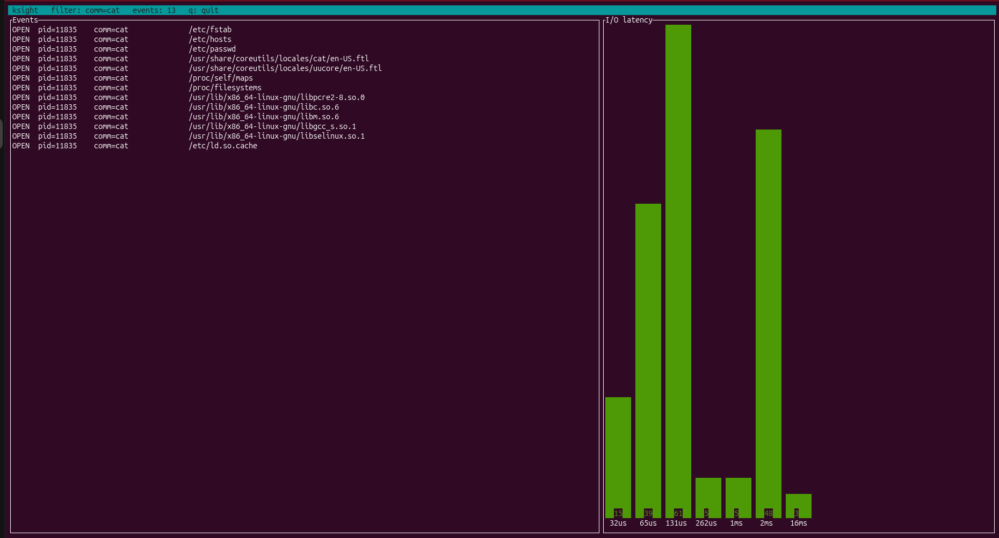

# ksight


eBPF-powered Linux runtime observability, written in Rust for both the kernel
and userspace using the [aya](https://aya-rs.dev) framework. `ksight` traces
process execution, file opens, and block-layer I/O latency directly at the
kernel boundary, filtering and aggregating in-kernel for low overhead, and
surfaces it all through a live terminal dashboard.

---




---

## Overview

`ksight` attaches eBPF programs to kernel tracepoints to observe what processes
are actually doing at the system-call and block-I/O boundary, without the
overhead of `ptrace`-based tools like `strace` and without running several
separate tracers in parallel.

A typical use case: a service feels slow, and you want to know why. Running
`sudo ksight --comm myservice` shows, live and side by side, every file the
process opens and a real-time histogram of how long its disk I/O is taking. At
a glance you can tell whether the process is opening far more files than
expected, or whether its reads are landing in a slow multi-millisecond tail
rather than the fast microsecond path, two very different problems that
otherwise require correlating output from `opensnoop`, `biolatency`, and
friends by hand.

Filtering and histogram aggregation happen *inside the kernel*, so events that
don't match a filter never cross into userspace, and per-I/O latencies are
bucketed in a kernel map rather than streamed out one by one. This keeps
`ksight` cheap enough to leave running.

## Why ksight?

Linux observability is often fragmented across multiple tools:

- `strace` for system calls
- `opensnoop` for file activity
- `biolatency` for storage latency

`ksight` combines a focused subset of these capabilities into a single
dashboard with in-kernel filtering and aggregation, making it easier to
understand what a process is doing without juggling multiple terminals.

## Features

- **Process execution tracing**: every `execve`, with PID and parent PID
  (resolved via CO-RE, Compile Once - Run Everywhere, from the kernel's `task_struct`).
- **File-open tracing**: every `openat`, with the resolved path.
- **Block I/O latency histogram**: a live, `biolatency`-style log2 histogram
  of block-device request latency, aggregated per-CPU in-kernel.
- **In-kernel filtering**: filter by PID or command name; non-matching events
  are rejected in the kernel before they ever occupy a ring-buffer slot.
- **Live terminal dashboard**: a two-pane [ratatui](https://ratatui.rs) UI:
  a streaming event log alongside the continuously updating latency histogram,
  with the active filter shown in the header.
- **Single executable**: no daemon and no external runtime services.

## Usage

`ksight` loads eBPF programs and attaches to kernel tracepoints, which requires
elevated privilege (see [Requirements](#requirements)).

Trace everything:

```bash
sudo ksight
```

Trace only a specific command:

```bash
sudo ksight --comm cat
```

Trace only a specific process:

```bash
sudo ksight --pid 1234
```

`--pid` and `--comm` are mutually exclusive. Press `q` to quit.

The dashboard has two panes. The left pane is a live log of `exec` and `open`
events as they happen; the right pane is the block I/O latency histogram,
refreshing continuously as requests complete. The header shows the active
filter, the running event count, and the quit key.

## Architecture

`ksight` is a Cargo workspace of four crates, split along the kernel/userspace
boundary:

| Crate | Role |
|-------|------|
| `ksight-common` | `#[repr(C)]` wire types shared between kernel and userspace. `no_std`, no allocation. |
| `ksight-ebpf` | The eBPF programs themselves (`no_std`), compiled for the `bpfel-unknown-none` target. |
| `ksight-agent` | Userspace loader: attaches programs, reads the ring buffer and histogram map, owns the event loop. Split into a tested library plus a thin binary. |
| `ksight-tui` | Presentation only, defines the dashboard state and renders it. Knows nothing about eBPF. |

Data crosses from kernel to userspace through two distinct channels, because
the data has two distinct shapes:

- **Streaming events** (`exec`, `open`) flow through a single ring buffer as a
  tagged union. Each event carries a kind tag, and userspace matches on it.
  This preserves global ordering across event types in one channel.
- **Aggregated metrics** (the latency histogram) live in a per-CPU array map.
  The kernel increments log2 latency buckets in place; userspace reads the
  whole histogram on a timer and sums across CPUs. A histogram is a snapshot of
  accumulated state, not a stream of events, so it gets its own map rather than
  being forced into the event channel.

The agent's event loop is a single `tokio::select!` over three sources: the
ring buffer (decode and display events), a timer tick (read and redraw the
histogram), and keyboard input (quit).

## Design Decisions

**Tracepoints over kprobes for block I/O.** During development on the target
kernel, the traditional `blk_account_io_*` kprobe targets were unavailable, so
`ksight` uses the `block:block_rq_issue` and `block:block_rq_complete`
tracepoints instead. Tracepoints provide a more stable ABI across kernel versions than kprobes on internal kernel functions.

**Filtering before reservation.** The filter check runs at the top of each
probe, before any ring-buffer space is reserved, so a rejected event costs
nothing beyond the comparison: no copy, no buffer slot, no userspace wakeup.
The filter is supplied from userspace through a config map the kernel reads on
each event.

**No floating point in the kernel.** eBPF has no floating point, so latency
histogram buckets are computed with integer `leading_zeros` (`floor(log2)`)
rather than a `log` call, and block requests are correlated across the two
tracepoints with a key whose padding is explicit and zeroed so the bytes hashed
on issue and completion match exactly.

Pure userspace components are unit tested, eBPF programs are validated by the
kernel verifier at load time, and the full tracing pipeline is exercised on
real hardware. CI builds the workspace, runs tests, enforces formatting, and
checks lint warnings on every push.

## Requirements

- **Linux kernel with BTF** (`CONFIG_DEBUG_INFO_BTF=y`), required for CO-RE
  relocation against the running kernel. Most modern distributions ship this;
  `ksight` reads `/sys/kernel/btf/vmlinux`.
- **A recent kernel**: developed and tested on kernel 7.0 (Ubuntu 26.04).
  Kernel 5.8+ is recommended so that `CAP_BPF` and `CAP_PERFMON` are available
  as discrete capabilities.
- **Elevated privilege**: loading eBPF programs and attaching to tracepoints
  requires `CAP_BPF` + `CAP_PERFMON` (or `CAP_SYS_ADMIN` on older kernels), so
  `ksight` is normally run with `sudo`.

## Installation

### Prebuilt binary

Download the latest release from the
[Releases page](https://github.com/WaiHlyanMinThein17/ksight/releases):

```bash
tar -xzf ksight-v0.1.0-x86_64-linux.tar.gz
cd ksight-v0.1.0-x86_64-linux
sudo ./ksight --comm cat
```

The release binary is built for x86_64 Linux and dynamically linked against
glibc. See [Requirements](#requirements) for kernel and privilege
prerequisites.

### From source

Building `ksight` requires the Rust toolchain plus the eBPF cross-compilation
tooling (a nightly toolchain with `rust-src` for the BPF target, and
`bpf-linker`).

```bash
# Toolchain prerequisites
rustup toolchain install nightly --component rust-src
cargo install bpf-linker

# Build
git clone https://github.com/WaiHlyanMinThein17/ksight.git
cd ksight
cargo build --release

# Run
sudo ./target/release/ksight --comm cat
```

### Snap

Strict-confinement snap packaging is planned. Because `ksight` loads eBPF and
attaches to tracepoints, it will require the `system-trace` interface to be
connected after installation:

```bash
# Planned, not yet published
sudo snap install ksight
sudo snap connect ksight:system-trace
```

## Roadmap

Potential future directions include:

- TCP connection tracing
- Session recording and replay
- Additional observability views
- Per-process I/O attribution
- Historical trace export

## Contributing

Contributions, bug reports, and suggestions are welcome. See
[CONTRIBUTING.md](CONTRIBUTING.md) for development setup and guidelines.

```bash
# Build (cross-compiles the eBPF object via the agent's build script)
cargo build

# Lint
cargo clippy --workspace --exclude ksight-ebpf -- -D warnings

# Test
cargo test --workspace --exclude ksight-ebpf

# Format
cargo fmt --all
```

## License

`ksight` is dual-licensed under either of

- MIT license ([LICENSE-MIT](LICENSE-MIT))
- Apache License, Version 2.0 ([LICENSE-APACHE](LICENSE-APACHE))

at your option.